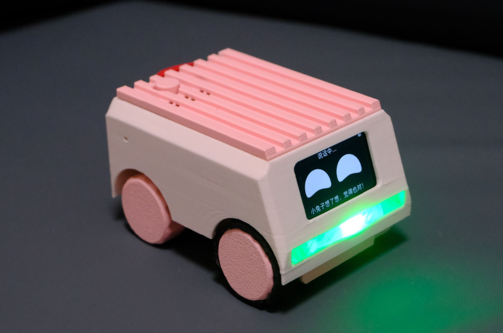
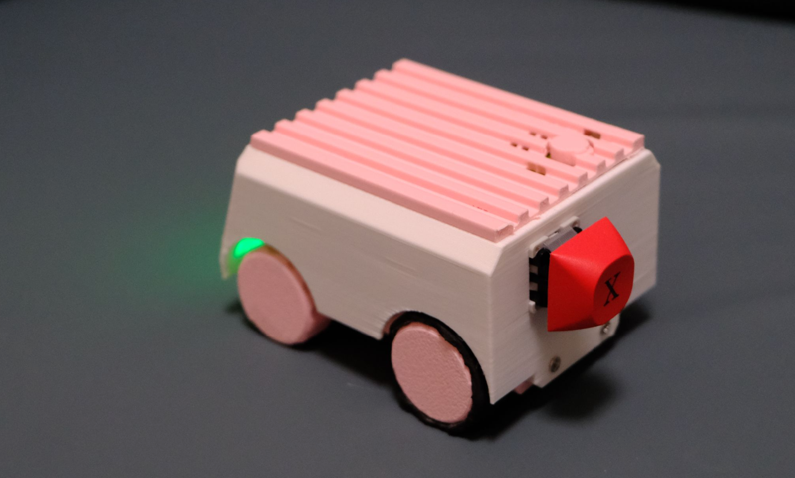

# VerdureBuddyRover

VerdureBuddyRover 是一个面向小型移动机器人/绿植陪伴车的硬件与软件仓库。当前已整合第一版 ESP32-C3 SuperMini 综合固件，包含 BQ27220 电池计量、DRV8833 双电机控制、BLE 蓝牙键盘按键上报、RGB5050 指示灯，以及面向上位机的 UART 行式调试协议。

## 项目简介

一个圆滚滚的可爱小车机器人，可以跟你对话聊天，也能用语音控制它前进、后退、转向，是一个能陪你玩、听你话的小车伙伴。





外壳模型源文件与 3D 打印文件见 [hardware/enclosure](hardware/enclosure) 目录。

## 当前内容

- [firmware/esp32c3_kb_motor](firmware/esp32c3_kb_motor): ESP32-C3 Arduino 固件。
- [docs/serial-protocol.md](docs/serial-protocol.md): 固件与上位机之间的串口协议。
- [docs/xiaozhi-mcp-serial-integration.md](docs/xiaozhi-mcp-serial-integration.md): 小智 MCP 到小车串口命令的对接规则。
- [docs/ble-keyboard-library.md](docs/ble-keyboard-library.md): BLE 键盘库崩溃原因和 NimBLE 迁移建议。
- [hardware/README.md](hardware/README.md): 硬件接线与后续硬件资料目录规划。
- [tools/host/README.md](tools/host/README.md): 预留的上位机调试工具目录。
- [docs/project-structure.md](docs/project-structure.md): 仓库目录组织原则。

## 上位机固件分支

小智上位机固件使用专用分支 `verdure-buddy-rover`，对应板卡目录为 M5Stack Atom Echo S3R：

- 固件分支：https://github.com/maker-community/xiaozhi-esp32/tree/verdure-buddy-rover
- 板卡目录（M5Stack Atom Echo S3R）：https://github.com/maker-community/xiaozhi-esp32/tree/verdure-buddy-rover/main/boards/m5stack/atom-echos3r
- 串口对接说明：[docs/xiaozhi-mcp-serial-integration.md](docs/xiaozhi-mcp-serial-integration.md)

## 推荐目录结构

```text
firmware/             # MCU 固件，按板卡或功能模块分目录
hardware/             # 接线、原理图、PCB、BOM、外壳结构资料
docs/                 # 协议、调试、架构、开发说明
tools/host/           # 上位机调试工具、串口助手、可视化控制台
scripts/              # 构建、烧录、诊断等自动化脚本（后续添加）
```

## 固件快速编译

Arduino IDE：打开 [firmware/esp32c3_kb_motor/esp32c3_kb_motor.ino](firmware/esp32c3_kb_motor/esp32c3_kb_motor.ino)，开发板选择 `ESP32C3 Dev Module`，并启用 `USB CDC on Boot`。

命令行编译示例（Windows）：

```powershell
$env:ARDUINO_DIRECTORIES_DATA="C:\arduino\Arduino15"
$env:ARDUINO_DIRECTORIES_USER="C:\arduino\Arduino"
& "$env:USERPROFILE\AppData\Local\Programs\Arduino IDE\resources\app\lib\backend\resources\arduino-cli.exe" compile `
	--fqbn esp32:esp32:esp32c3 `
	--build-path "C:\arduino\build_verdurebuddy_esp32c3" `
	"firmware\esp32c3_kb_motor"
```

已验证当前固件在本机通过编译：约 49% Flash、7% RAM。

## 依赖提示

当前固件依赖 Arduino 库 `kode_bq27220`、`HijelHID_BLEKeyboard` 及其依赖 `NimBLE-Arduino`。项目不要求修改第三方库源码；此前 BLE 连接崩溃是旧 BLE 后端中 `BLE2902` 描述符空指针导致的，当前固件已移除旧 BLE 键盘库代码。说明见 [docs/ble-keyboard-library.md](docs/ble-keyboard-library.md)。