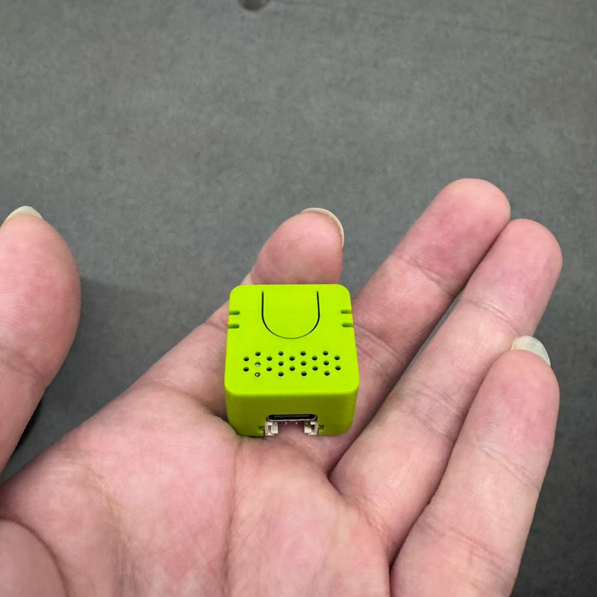

# Hardware

这里存放 VerdureBuddyRover 的硬件资料。当前固件对应的硬件连接如下，后续可以按硬件版本继续拆分。

## 外壳 (Enclosure)

圆滚滚的可爱小车外壳，可 3D 打印，渲染图如下：

### 模型来源

外壳模型托管在 [VerdureLab](https://github.com/maker-community/VerdureLab) 仓库的 `verdure-buddy-rover` 目录：

- 模型仓库：<https://github.com/maker-community/VerdureLab/tree/main/verdure-buddy-rover>
- 主项目仓库：<https://github.com/maker-community/VerdureBuddyRover>
- Gitee 镜像：<https://gitee.com/maker-community/VerdureLab>

打印文件为 STL（均位于该目录下），模型源文件为 Fusion 360 原始格式 `BuddyRover.f3z`，需要修改模型时可打开编辑：

| 部件 | 文件 |
|---|---|
| 上壳 | `上壳.stl` |
| 上壳（带按键槽） | `上壳带按键槽.stl` |
| 上壳（无按键） | `上壳无按键.stl` |
| 底盘 | `地盘.stl` |
| 垫板 | `垫板.stl` |
| 栅格 | `栅格.stl` |
| 灯条 | `灯条.stl` |
| 电源按键 | `电源按键.stl` |
| 轮胎（左前/右前） | `轮胎左前.stl` / `轮胎右前.stl` |
| 模型源文件 | `BuddyRover.f3z` (Fusion 360) |

本地仅保留渲染图，完整的 STL 与源文件以上述仓库为准。

## 上位机 (Atom VoiceS3R)

小车由 M5Stack **Atom VoiceS3R**（SKU: C126-ECHO）作为上位机，运行小智语音助手固件（`verdure-buddy-rover` 分支），通过串口控制下位机 ESP32-C3 电机板。实物：

| 项目 | 规格 |
|---|---|
| 主控 | ESP32-S3-PICO-1-N8R8，双核 Xtensa LX7 @ 240 MHz |
| Flash / PSRAM | 8 MB / 8 MB Octal |
| 音频 | ES8311 编解码 + MEMS 麦克风 (SNR 65 dB) + NS4150B 功放 |
| 扬声器 | 8Ω @ 1W 1318 型腔体喇叭 |
| 输入电源 | DC 5V |
| 尺寸 / 重量 | 24.0 × 24.0 × 16.8 mm / 9.3 g |
| 扩展接口 | HY2.0-4P (PORT.CUSTOM: GND / 5V / G2 / G1) |
| 红外 | 集成 IR 发射管 |

- 官方文档：<https://docs.m5stack.com/zh_CN/core/Atom_EchoS3R>
- 上位机固件分支：<https://github.com/maker-community/xiaozhi-esp32/tree/verdure-buddy-rover>
- 板卡目录：`main/boards/m5stack/atom-echos3r`
- 小智 MCP 串口对接规则：[docs/xiaozhi-mcp-serial-integration.md](../docs/xiaozhi-mcp-serial-integration.md)

上位机 Verdure 变体在 Grove G1/G2（GPIO1/GPIO2）上引出串口，以 115200 8N1 与下位机通信；同时扩展了一块 1.47" ST7789 172×320 屏幕用于状态显示。

### 上位机 ↔ 下位机接线

上位机与下位机交叉连接 UART，并共地：

| Atom VoiceS3R | ESP32-C3 | 说明 |
|---|---|---|
| G1 (GPIO1, UART TX) | GPIO21 (UART1 RX) | 上位机发送 → 下位机接收 |
| G2 (GPIO2, UART RX) | GPIO20 (UART1 TX) | 下位机发送 → 上位机接收 |
| GND | GND | 必须共地 |

上位机与下位机共电源时复位不同步，上位机固件会在启动后延迟 8 秒（`MOTOR_BOARD_STARTUP_DELAY_MS`）再与下位机通信，并以 `ping` 探活等待下位机 `READY`。

## 当前接线

| 模块 | ESP32-C3 引脚 | 说明 |
|---|---|---|
| BQ27220 SDA | GPIO5 | I2C 数据线 |
| BQ27220 SCL | GPIO6 | I2C 时钟线 |
| DRV8833 AIN1 | GPIO0 | 电机 A 方向/PWM |
| DRV8833 AIN2 | GPIO1 | 电机 A 方向/PWM |
| DRV8833 BIN1 | GPIO4 | 电机 B 方向/PWM |
| DRV8833 BIN2 | GPIO7 | 电机 B 方向/PWM |
| 按键 | GPIO10 | 接 GND，内部上拉，按下为低 |
| RGB5050 R | GPIO2 | 共阴 RGB，需限流电阻 |
| RGB5050 G | GPIO3 | 共阴 RGB，需限流电阻 |
| RGB5050 B | GPIO9 | 共阴 RGB，需限流电阻 |
| UART1 TX | GPIO20 | 接上位机 Atom VoiceS3R G2 (RX) |
| UART1 RX | GPIO21 | 接上位机 Atom VoiceS3R G1 (TX) |

## 后续建议

- `hardware/rev-a/`: 第一版面包板或洞洞板接线记录。
- `hardware/rev-b/`: PCB 原理图、Gerber、BOM、装配说明。
- `hardware/enclosure/`: 外壳、底盘、3D 打印文件。
- `hardware/assets/`: 接线图、实物照片、示波器截图等图片资料。

硬件改动会直接影响 [firmware/esp32c3_kb_motor/esp32c3_kb_motor.ino](../firmware/esp32c3_kb_motor/esp32c3_kb_motor.ino) 中的引脚配置，建议每次调整都同步更新这里。